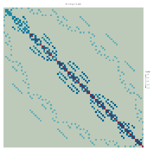

# BH_ED

[](https://github.com/WeiMXi/BH_ED.jl/actions)
[](https://codecov.io/gh/WeiMXi/BH_ED.jl)

It's a Julia program for repetition of some work in [Exact diagonalization: Bose–Hubbard model | stone-zeng.github.io](https://stone-zeng.github.io/2019-10-03-exact-diagonalization/)

But our work is a bit different with the reference.

Done by Dr. Ning and me.

Our Hamiltonion formula:


## For start, just

```Julia
]add https://github.com/WeiMXi/BH_ED.jl
using BH_ED
#]up BH_ED # for update the pkg
```

### Get the solver

```julia
julia> sol = BH_solver()
- N: 4 with Lp: 2
- We got all required states.
- Dimension of Hilbert space: 81
- We get Hamiltonion Matrix.
- Number of nonzero elements: 584 (8.901%) of total.
- Hamiltonion Matrix is a Real Symmetric Matrix.
- Strat to calculate the correlation function.
- Ground energy is -7.456060433500101
- The corresponding number of particles is 3.661445670989614
- Then We will return the eigenvalue, the corresponding eigenvector, the number of particles and the correlation function(as your setting).
([-7.456060433500098], [[0.04471760208007585, 1.079388233139614e-15, 1.122697968763188e-14, 5.378240580013517e-15, 1.6121294637898837e-15, 0.11788076158415632, 0.14679011111052417, 0.11788076158412045, 0.1524090635246442, 0.1467901111105383  …  0.05177177698781338, 0.05748632669029057, 0.03729158070076383, 0.051771776987840815, 0.03729158070074095, -5.838749250828237e-15, -3.122235738324105e-15, -4.5878852590447294e-15, -7.327893030091186e-15, 0.005421268027986857]], 3.661445670989615, [1.394246146628383, 0.6185477407236198, 0.9107890892570526, 0.6185477407236198, 1.394246146628383])

julia> sol[1]   # the eigenvaluse
1-element Vector{Float64}:
 -7.456060433500101

julia> sol[2]   #  the corresponding eigenvector
1-element Vector{Vector{Float64}}:
 [0.044717602080091706, 5.34243661036335e-15, 2.79822415075818e-14, -2.8995972861870584e-14, -6.426105929071362e-15, 0.1178807615841563, 0.1467901111105439, 0.11788076158414823, 0.15240906352466405, 0.14679011111051374  …  0.05177177698783195, 0.05748632669031149, 0.0372915807007639, 0.051771776987821365, 0.03729158070076026, -3.871934678380099e-15, -4.396147957426899e-15, -4.813887100734731e-15, -4.878415205520143e-15, 0.005421268027985144]

julia> sol[3]   # the number of particles of eigenvector
3.661445670989614

julia> sol[4]   # correlation function
5-element Vector{Float64}:
 1.394246146628383
 0.6185477407236198
 0.9107890892570526
 0.6185477407236198
 1.394246146628383
```

### Get the Hamiltonion Matrix

```julia
julia> them = give_a_BH_Model(N = 6, Lp = 3);

julia> theh = give_H(them)
4096×4096 SparseArrays.SparseMatrixCSC{Float64, Int64} with 56302 stored entries:
⣿⣿⣛⠳⢦⣴⣄⡀⢀⠀⠀⠀⠀⠀⠀⠀⠀⠀⠀⠀⠀⠀⠀⠀⠀⠀⠀⠀⠀⠀⠀⠀⠀⠀
⢿⡘⠿⣧⣀⡀⠉⠛⠾⣷⣄⡀⢀⡀⠀⠀⠀⠀⠀⠀⠀⠀⠀⠀⠀⠀⠀⠀⠀⠀⠀⠀⠀⠀
⢈⣷⠀⠸⢿⣷⡄⠀⠀⠀⠙⠳⣦⣙⢦⠀⠀⠀⠀⠀⠀⠀⠀⠀⠀⠀⠀⠀⠀⠀⠀⠀⠀⠀
⠀⠹⣧⠀⠀⠉⣻⣾⣦⡀⠀⠀⠀⠉⠹⣷⣀⠳⣄⠀⠀⠀⠀⠀⠀⠀⠀⠀⠀⠀⠀⠀⠀⠀
⠀⠐⢾⣧⠀⠀⠈⠻⢿⣷⡄⠀⠀⠀⠀⠈⠛⢶⣌⡃⠀⠀⠀⠀⠀⠀⠀⠀⠀⠀⠀⠀⠀⠀
⠀⠀⠀⠹⢷⡀⠀⠀⠀⠉⣿⣿⣦⡀⠀⠀⠀⠀⠈⠻⣦⡙⢦⡀⠀⠀⠀⠀⠀⠀⠀⠀⠀⠀
⠀⠀⠀⠰⣌⢻⡄⠀⠀⠀⠈⠻⣿⣿⣆⠀⠀⠀⠀⠀⠙⢷⣦⡙⠀⠀⠀⠀⠀⠀⠀⠀⠀⠀
⠀⠀⠀⠀⠈⠓⢷⣦⡀⠀⠀⠀⠈⠙⢻⣶⣦⡀⠀⠀⠀⠀⠈⠻⣆⠲⣄⠀⠀⠀⠀⠀⠀⠀
⠀⠀⠀⠀⠀⠀⢤⡘⢻⣄⠀⠀⠀⠀⠈⠻⣟⣽⣦⡀⠀⠀⠀⠀⠙⣧⡌⠓⠀⠀⠀⠀⠀⠀
⠀⠀⠀⠀⠀⠀⠀⠙⠦⠹⣦⡀⠀⠀⠀⠀⠈⠻⠿⣧⣄⡀⠀⠀⠀⠈⠻⢷⢤⡀⠀⠀⠀⠀
⠀⠀⠀⠀⠀⠀⠀⠀⠀⠀⣌⠻⢷⣄⠀⠀⠀⠀⠀⠹⣿⣿⣦⡀⠀⠀⠀⠘⣧⡙⠆⠀⠀⠀
⠀⠀⠀⠀⠀⠀⠀⠀⠀⠀⠈⠳⣌⠻⣦⡀⠀⠀⠀⠀⠈⠻⣿⣿⣀⠀⠀⠀⠈⢷⣆⠀⠀⠀
⠀⠀⠀⠀⠀⠀⠀⠀⠀⠀⠀⠀⠀⠀⢨⡙⠷⣤⡀⠀⠀⠀⠀⠘⢿⣷⣦⡀⠀⠀⢻⡷⠄⠀
⠀⠀⠀⠀⠀⠀⠀⠀⠀⠀⠀⠀⠀⠀⠀⠙⢦⠉⢿⣆⣀⠀⠀⠀⠈⠻⡿⣯⣀⠀⠀⢻⣆⠀
⠀⠀⠀⠀⠀⠀⠀⠀⠀⠀⠀⠀⠀⠀⠀⠀⠀⠀⠀⠳⣍⠻⢦⣄⠀⠀⠀⠘⢿⣷⡆⠀⢿⡁
⠀⠀⠀⠀⠀⠀⠀⠀⠀⠀⠀⠀⠀⠀⠀⠀⠀⠀⠀⠀⠈⠁⠈⠙⢿⡶⣤⣀⠈⠉⢻⣶⡌⣷
⠀⠀⠀⠀⠀⠀⠀⠀⠀⠀⠀⠀⠀⠀⠀⠀⠀⠀⠀⠀⠀⠀⠀⠀⠀⠁⠈⠙⠟⠳⢦⣭⣿⣿

```

## Help
```
?BH_soler
?give_a_BH_Model
?give_give_H
```



